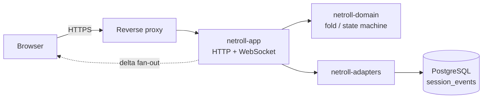

# Architecture

NetRoll ships as one container image and one database. The image holds a Rust binary that
serves the HTTP API, the WebSocket, the built React app and the documentation from a single
port. PostgreSQL is the only other thing running.

## The crates

Three crates live under `backend/crates/`.

- **`netroll-domain`** owns the rules: net definitions, sessions, check-ins, the event fold
  and the session state machine, authorization decisions, and the port traits everything else
  implements. It has no I/O and no async runtime; its `Cargo.toml` says never add `sqlx`,
  `tokio`, `axum` or `fred` here.
- **`netroll-adapters`** implements the ports: the PostgreSQL repositories and event log under
  `pg/`, SMTP mail, the SSRF-guarded egress client, envelope encryption, callbook lookups. No
  business rules.
- **`netroll-app`** is the binary and composition root: configuration, the axum routes under
  `http/`, the WebSocket hub under `ws/`, middleware, the Content Security Policy, static
  serving, and the background jobs (delivery, occurrence spawning, retention, presence).

The **frontend** under `frontend/` is a Vite, React and TypeScript single-page app.
`features/` compose the primitives in `ui/`. Its session store is the single owner of live
session state and folds the same event kinds the backend emits.

## The one rule

Dependencies point inward: app depends on adapters, adapters depend on domain, and the domain
depends on nothing. That decides where a change goes. If it needs a database or the network,
it is an adapter. If it needs a rule, it is domain. If it needs a route or a job, it is app.

## A request, end to end

Every change to a live session is appended to `session_events` with a per-session `seq`. That
one log is the live stream, the reconnect source, the audit trail and the export source.
Folding it is deterministic, so a client that reconnects asks for everything after the last
`seq` it saw and arrives at the same state.

The domain declares a session's lifecycle (`scheduled`, `live`, `closed`) and, on a live
session, its control state (`active`, `stalled`). Two operators editing one entry are separated by a
soft lock — a server-held sliding lease that is advisory only; a compare-and-swap on the
entry's version inside the append transaction is the correctness authority, and it rejects the
stale write. The frontend reports its own connection as
`live`, `catching-up`, `out-of-sync` or `net-paused`. Authorization is capability-based and
enforced server-side on every net-scoped mutation. A session snapshots its definition when
it starts, so editing a net never disturbs a net already running.

## Where to look

- [`docs/reference/http-api.md`](docs/reference/http-api.md) and
  [`docs/reference/websocket-protocol.md`](docs/reference/websocket-protocol.md): the wire.
- [`docs/reference/vocabulary.md`](docs/reference/vocabulary.md): the words the code and the
  docs are held to.
- [`CONTRIBUTING.md`](CONTRIBUTING.md): the checks and the rules a first pull request meets.
