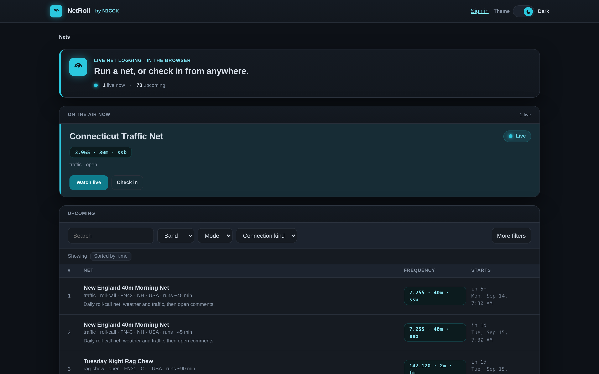
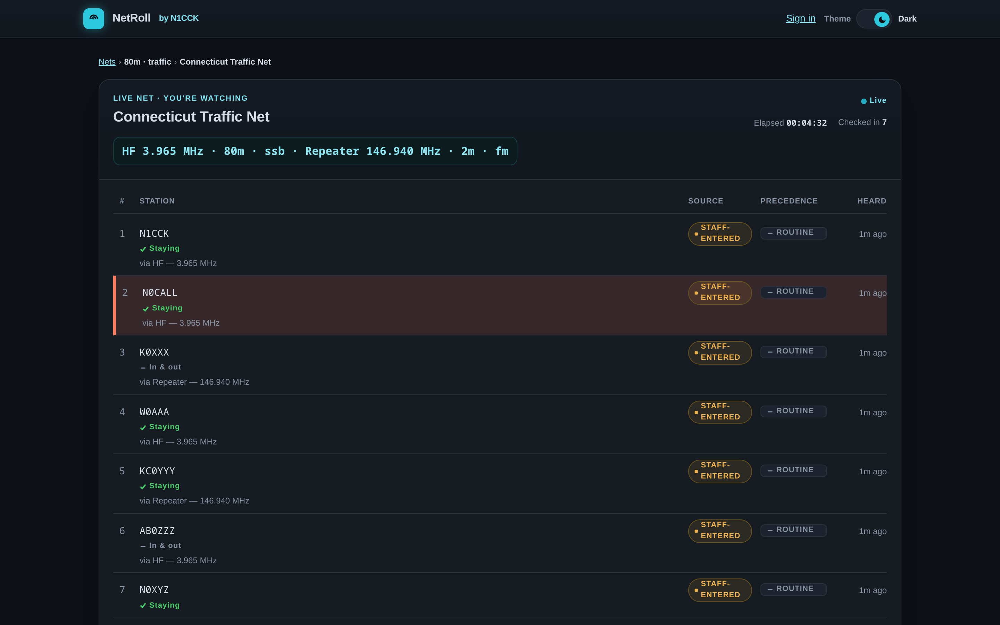

# NetRoll

A browser app for running amateur-radio nets, and a public directory of the nets that are on
the air right now or coming up.

## [Find a net at netroll.n1cck.radio](https://netroll.n1cck.radio)

No account needed to look: the directory shows which nets are live and which are next, and
every live net has a public roster you can watch as stations check in.

A repeater directory is only useful because everyone lists in the same one, and NetRoll's
directory works the same way. A net listed on the public instance is findable by every ham who
looks there, and every net that lists makes the directory worth looking at for the next one.

If you run a net, check into nets, or want to find one, this is for you.

## What it does

<!-- capabilities:start -->
- A public directory of live and upcoming nets, filterable by name, band, mode, connection
  kind and country.
- Net definitions with one or more ways in: HF, repeater, EchoLink, AllStar, DMR, D-STAR, YSF,
  URF or another you name.
- Schedules with recurrence that follows the net's own time zone through daylight-saving
  changes.
- Live sessions with a shared roster, a working station and rounds, updated in every open
  browser as they happen.
- Self check-in from a participant's own browser, marked as such on the roster.
- Per-net roles: owner, net control, logger and relay, each with its own permissions.
- Hand-off of net control to another operator, and a claim path when net control drops out.
- Moderation of a session: check-ins can be hidden or removed by the people running it.
- CSV and ADIF export of the roster when a net closes.
- On-close delivery by email, signed webhook or Discord.
- QRZ callbook lookups, with credentials stored encrypted under an instance key.
- Passwordless sign-in by magic link.
- A small admin surface for abuse reports and account disabling.
- One container image plus PostgreSQL, self-hostable, serving its own documentation at `/docs`.
<!-- capabilities:end -->

## Self-hosting

NetRoll is one container image and a PostgreSQL database. Nothing in it depends on
infrastructure N1CCK operates. Analytics and the footer donation link are off unless you set
them, and even switched on they load no third-party script.

- [Self-hosting quickstart](docs/self-hosting/quickstart.md): the walkthrough, from a compose
  file to a first sign-in.
- [`deploy/README.md`](deploy/README.md): what each shipped file is, the full variable table, and
  the reverse-proxy split.
- [Configuration reference](docs/reference/configuration.md): every environment variable.

## Documentation

Full documentation lives in [`docs/`](docs/index.md). Every instance serves it at `/docs` for
the exact version it runs, so [netroll.n1cck.radio/docs](https://netroll.n1cck.radio/docs/) is
the public instance's, and yours is your own.

| You want to | Start here |
|-------------|-----------|
| Run a net | [Run your first net](docs/getting-started/run-your-first-net.md) |
| Join a net | [Join a net](docs/getting-started/join-a-net.md) |
| Run your own instance | [Self-hosting quickstart](docs/self-hosting/quickstart.md) |
| Look something up | [Reference](docs/reference/index.md) |
| Fix something broken | [Troubleshooting](docs/troubleshooting/index.md) |

## Contributing

Read [CONTRIBUTING.md](CONTRIBUTING.md) first. The repository has no private branches, so
everything you push is public the moment you push it. Open the devcontainer, run the checks,
send a pull request.

## License

[Reciprocal Public License 1.5](LICENSE.md). It is a reciprocal licence: running a modified copy
means sharing your changes in source form. CONTRIBUTING.md has the plain-language paragraph.

Copyright Nick Booth, N1CCK.
