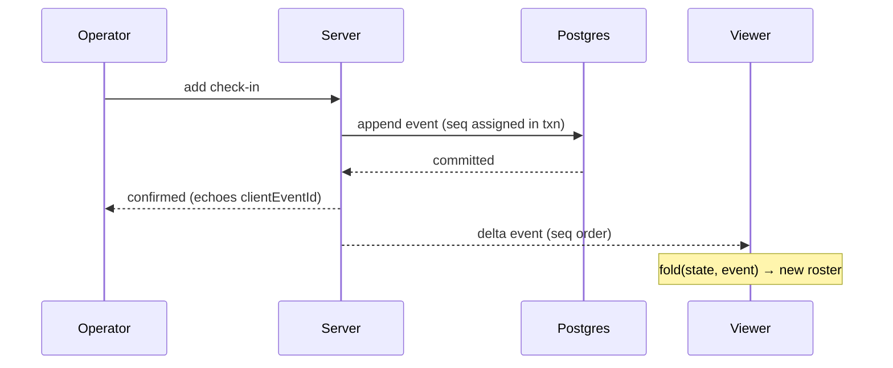

# Live updates

Every viewer of a NetRoll session sees the same roster, in the same order, without refreshing.
This page explains the mechanism behind that — useful if you're wondering what "catching up"
means on your screen, or if you're building something against the stream.

## How it works

Everything that happens in a session is appended to an ordered event log in Postgres. Each event
carries a per-session sequence number, `seq`, assigned inside the write transaction with no gaps
and no duplicates. The log is the single source of truth: live state, reconnect, the summary,
and the exports are all *folded* from it.

A client connecting fresh receives a **snapshot** — the folded state plus the latest `seq` —
then live **deltas** in `seq` order. A client reconnecting sends the last `seq` it saw and gets
exactly the events after it, then rejoins the live stream. No gaps, no duplicates.

Applying the same event twice never duplicates a roster entry, so a retried write is safe.

## Key terms

| Term | Definition |
|------|-----------|
| Event | One recorded fact, named `noun.verb` in the past tense — `checkin.added`, `frequency.changed`, `session.closed`. |
| `seq` | The per-session monotonic sequence number. Also the client's resume cursor. |
| Fold | Applying events in order to derive current state. Deterministic. |
| Snapshot | The folded state plus latest `seq`, sent once on a fresh connect. |
| Delta | A single event pushed to connected clients as it's appended. |
| Optimistic write | The originating client's own pending entry, shown before the server confirms it. |

## What the connection statuses mean

The connection pill always shows a colour, an icon, and a label together — never colour alone.

| Status | What it means |
|--------|---------------|
| Live | Connected and current. |
| Catching up | Reconnected, replaying the events missed. The banner reads "Reconnecting — catching up…". |
| Out of sync | Lost the server. The banner reads "Lost the server — showing last known roster" and offers a resync. |
| Net paused | Not a connection problem. Net control's heartbeat stopped; see [session lifecycle](session-lifecycle.md). |

If you have reduced motion enabled, the live-dot pulse is disabled and status changes apply
instantly — the colour, icon, and label still switch.

## Why you see your own entry before anyone else does

The client that made a change tags it with a client event id and shows it immediately as
*pending*. When the server echoes that id back in the authoritative event, the pending entry
reconciles into the confirmed one.

Other viewers render authoritative events only. Nobody ever sees another client's unconfirmed
write, so the roster everyone else is reading is always the roster the server agrees with.

## Limits and considerations

**Postgres is the ordering authority, not the cache.** The pub/sub layer only notifies
connected servers that an event landed. If it's unavailable, truth is still recorded in
Postgres and clients recover through the resume path — correctness never depends on the cache.

**The propagation target is about two seconds.** Measured server-commit to client-receipt at the
WebSocket layer, at the 95th percentile, under expected load. It excludes how long your device
takes to paint.

**Read access needs no account.** An account-less client gets the same stream, read-only, with
no write capability.

## Related tasks

- [Join a net](../getting-started/join-a-net.md)
- [Session lifecycle](session-lifecycle.md)
- [WebSocket protocol](../reference/websocket-protocol.md) — the wire format, for integrators
- [Troubleshooting live sessions](../troubleshooting/live-sessions.md)
