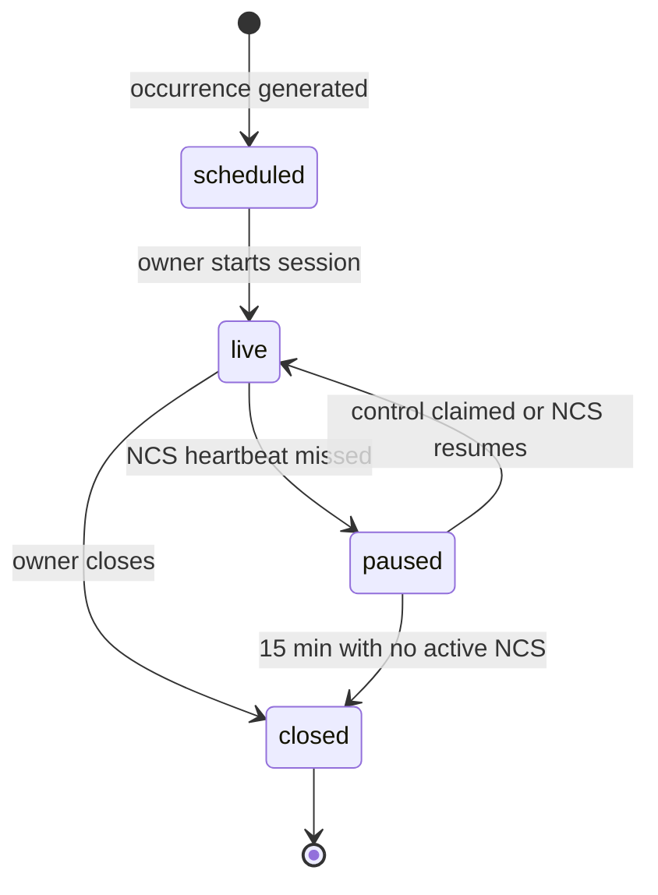

# Session lifecycle

A NetRoll *session* is one live occurrence of a net. It has a small, strictly-enforced set of
states, and the transitions between them decide what anyone can do at a given moment. This page
explains the states and the two rules people most often trip over: what makes a session pause,
and why editing a net doesn't change a net already running.

## How it works

Invalid transitions are rejected as domain errors, not silently ignored. Closing a session that
never went live, or starting one that is already live, fails.

## Key terms

| Term | Definition |
|------|-----------|
| Net definition | The reusable description of a net. Versioned; editing increments the version. |
| Occurrence | One scheduled dated instance of a net, generated from its schedule. |
| Session | One live run of a net. Snapshots the definition when it starts. |
| Scheduled | An occurrence exists but nobody has started it. |
| Live | The session is running. Check-ins and edits are accepted. |
| Paused | Net control's heartbeat stopped. Roster frozen, writes suspended, surfaced as net-paused. |
| Closed | The session is over. No further mutations. Summary and exports available. |
| Event log | The ordered, append-only record of everything that happened in the session. |

## Why a session is isolated from its definition

When a session starts, it stores the definition's id, its version, and a snapshot of the
relevant fields. Everything the session displays comes from that snapshot.

That isolation is deliberate. It means an owner can fix a typo, change a repeater tone, or
adjust the schedule in the middle of a net without the running net shifting under the operators
using it. The edit lands on future occurrences only.

It also means past sessions stay accurate forever. Each one remains attributable to the exact
definition version it ran from, so a log from two years ago still reflects what the net was
then — even if the definition has since been archived.

## Why closing is a state, not a deletion

Closing appends a close event rather than tearing anything down. The summary, the CSV, and the
ADIF are all folded from the same event log, which is why they always agree with each other and
with what viewers saw live.

The same is true of the auto-close path. A session abandoned for 15 minutes is closed by an
idempotent background job that produces the summary the same way a manual close does.

## Limits and considerations

**A session has exactly one active NCS.** Control is server-authoritative. Two operators cannot
both hold it, and a handoff moves it atomically.

**Pausing is not closing.** A paused session is recoverable — the original NCS can come back, or
a co-owner or logger can claim control. Only the 15-minute timeout turns an abandoned session
into a closed one.

**Reading is public at every state.** Live, paused, or closed, a session is readable without an
account. What changes with state is what may be *written*.

## Related tasks

- [Start and close a session](start-and-close-a-session.md)
- [Hand off net control](hand-off-net-control.md)
- [Schedule a net](../nets/schedule-a-net.md)
- [Live updates](live-updates.md)
