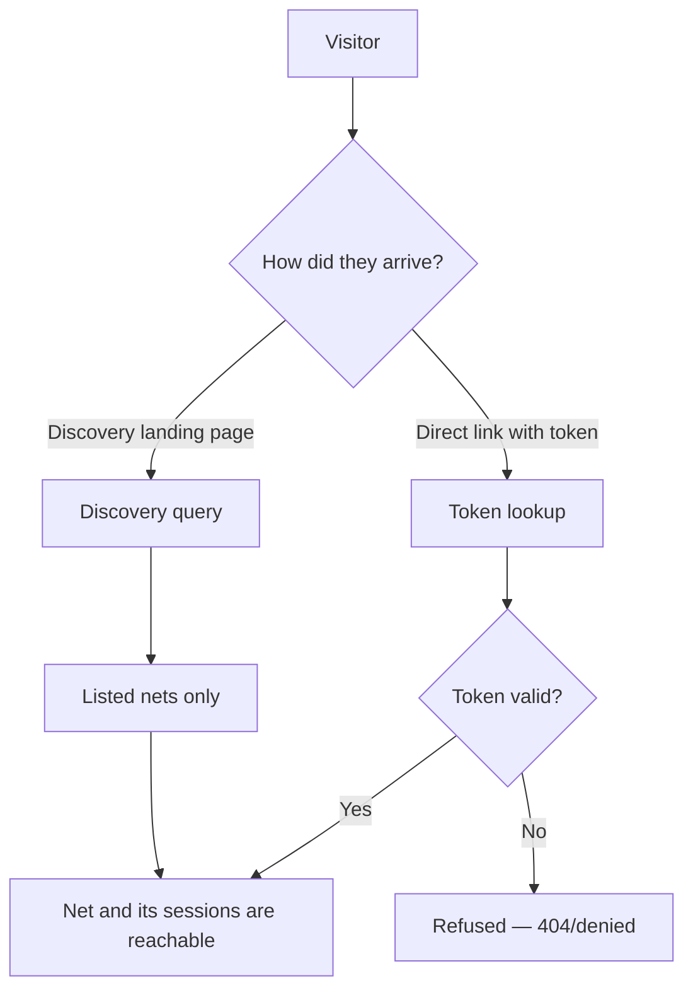

# Net visibility

Every NetRoll net is either **Listed** or **Unlisted**. Visibility controls whether the net
appears in discovery — it does not encrypt anything or gate who may read a session that someone
has reached. This page explains what each setting actually protects, so you can pick the right
one for a club net, a training net, or a private schedule.

## How it works

Discovery queries return Listed nets only. Unlisted nets are excluded from every discovery
result — the hero, the upcoming list, filters, and sorts.

**Every net has a link token** — a non-guessable value in the URL, not derived from the net's
id, so nobody can walk ids to find a net. For an Unlisted net the token is the only way in. For
a Listed net it is a second way in alongside discovery, and discovery links the title to it. A
request to the permalink URL without a valid token is refused — a Listed net is still reachable
through discovery without one.

## Key terms

| Term | Definition |
|------|-----------|
| Listed | The default. The net and its scheduled occurrences appear in discovery. |
| Unlisted | The net never appears in discovery. It is reachable only through its link token URL. |
| Link token | A non-guessable token in a net's permalink URL. Every net has one, whatever its visibility. Not derived from the net's id. |
| Discovery | The public landing surface: the active-now hero plus the filterable upcoming list. |

## Limits and considerations

**Unlisted is not private.** Anyone holding the link can open the net and its live sessions.
Treat the token like an unlisted phone number, not like a password. If a token leaks, the only
remedy is to stop using that net definition.

**Listing a net publishes its token.** Discovery links every Listed net's title to its
permalink, so anyone browsing — or scraping — Discovery while a net is Listed can keep that
link. Switching the net back to Unlisted does not revoke it: the token does not change with
visibility.

**Live sessions are publicly readable either way.** Reading a session — the roster, the
ways in, the working-station highlight — never requires an account. Visibility
changes who can *find* the session, not who may read it once found.

**Writes are authorized separately.** Being able to open a session grants no ability to change
it. Check-ins, signal reports, moderation, and control are all governed by
[roles and permissions](../reference/roles-and-permissions.md), enforced server-side.

**Public reads are rate-limited.** Discovery and session-view reads are throttled per client to
deter scraping. Over the threshold, the server returns HTTP 429 with retry information.

## Related tasks

- [Create a net](create-a-net.md) — where you choose visibility, and how to share a link token
- [Schedule a net](schedule-a-net.md) — only Listed nets appear in the upcoming list
- [Join a net](../getting-started/join-a-net.md) — the visitor's side of discovery
