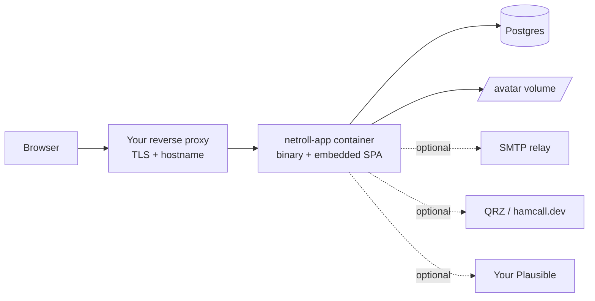

# Deployment model

NetRoll is deliberately a single artifact: one binary that also serves the frontend. This page
explains what that image contains, what state exists around it, and what the app does for itself
at boot — so you know what you're responsible for and what you aren't.

## How it works

The container runs one process. `STATIC_DIR` is baked into the image and points at the built SPA,
so the binary serves the API, the frontend, and this documentation on a single port.

The docs are built into `/app/static/docs` at image build time, which means **your own instance
serves them at `/docs`** — matched to the exact version you're running, with no network access
needed. The diagram renderer is bundled with the docs, so nothing is fetched from a CDN either.

Everything dotted is optional or outbound-only. NetRoll never calls back to anything N1CCK
operates.

## Key terms

| Term | Definition |
|------|-----------|
| Image | `ghcr.io/nkbooth/netroll` — UBI9 build stage, ubi-minimal runtime, single binary with the SPA and docs. |
| Hero instance | The instance N1CCK operates at `netroll.n1cck.radio`. Operated on a best-effort basis with no availability guarantee — no SLA is offered. Not required by anyone else. |
| Egress client | The single SSRF-guarded HTTP client every outbound request goes through. |
| Boot migration | Schema migration applied by the app itself on startup. |

## What the app does for itself

**Applies migrations.** The app migrates its own schema at boot. There's no separate migration
command and no init container.

**Creates its own database extension.** One boot migration runs
`CREATE EXTENSION IF NOT EXISTS pg_trgm` — the trigram module behind the title searches on the
discovery page and in the admin console. `pg_trgm` is a *trusted* extension from PostgreSQL 13
on, so the role that owns the database is enough and no superuser step is needed, and the
official `postgres` image ships the files. It is still a hard boot requirement: a Postgres that
refuses the extension stops the upgrade at that migration, and the app does not start.

**Validates configuration and fails loudly.** Required variables missing, or optional ones set
to invalid values, are hard boot errors rather than silent fallbacks. A malformed encryption key
stops the app; a too-short bot-mitigation secret stops the app. The reasoning is that a value
that looks configured but silently does nothing is worse than a refusal to start. Optional
features that are merely *unset* degrade cleanly instead — QRZ endpoints return HTTP 503 with no
key configured, and the admin surface is unreachable with no admin emails.

**Guards its own outbound requests.** Webhook delivery and callbook lookups go through one
egress client: HTTPS-only, resolved IP pinned for the connection, bounded redirects and
timeouts, a response-size cap, and refusal of loopback, link-local, private, and cloud-metadata
addresses. That's what makes it safe to let a net owner type in a webhook URL.

## Where state lives

| State | Where | Backup |
|-------|-------|--------|
| Everything about accounts, nets, sessions, and event logs | Postgres | `pg_dump` |
| Uploaded avatars | The `AVATAR_DIR` volume | Volume snapshot |
| Session event ordering | Postgres, authoritative | Covered by `pg_dump` |
| Encryption key for QRZ credentials | Injected at runtime only | Your secret store — never in Postgres or backups |

The encryption key is the one piece deliberately outside your database backup. Restoring a dump
onto an instance without the original key leaves stored QRZ credentials permanently
undecryptable, which is the intended property: a database leak alone doesn't expose them. Don't
rotate that key casually.

## Limits and considerations

**Single-node rate limiting.** The rate limiter is in-app and per-process. Running multiple app
replicas behind a load balancer multiplies the effective limits, since each process counts
independently.

**Reverse proxy required in practice.** The app serves plain HTTP on one port. TLS and the public
hostname are your proxy's job. The Content Security Policy is **not**: the app sends its own on
every HTML page, derived from `PUBLIC_BASE_URL` and your analytics settings, and your proxy must
not set one — two CSP headers on a response are enforced together, and the intersection breaks
the app. A starting point that gets the split right is
[`deploy/reverse-proxy/Caddyfile.example`](https://github.com/nkbooth/netroll/blob/main/deploy/reverse-proxy/Caddyfile.example).

**Email is not optional in practice.** Sign-in is a magic link. An instance without working SMTP
is an instance nobody can log in to, even though the app will boot happily.

**`pg_trgm` must be available.** Managed Postgres providers that allow-list extensions may not
offer it, and PostgreSQL 12 and older only let a superuser create it. There is no fallback path —
the title searches are written for the trigram indexes and the app does not run without them.
Confirm the extension before pointing NetRoll at a database you don't operate yourself; the
[upgrade guide](upgrade-an-instance.md#if-the-container-exits-with-an-extension-error) covers
the boot failure and its remedy.

## Related tasks

- [Self-hosting quickstart](quickstart.md)
- [Upgrade an instance](upgrade-an-instance.md)
- [Configuration reference](../reference/configuration.md)
- [ARCHITECTURE.md](https://github.com/nkbooth/netroll/blob/main/ARCHITECTURE.md) on GitHub — the internal shape of the binary
